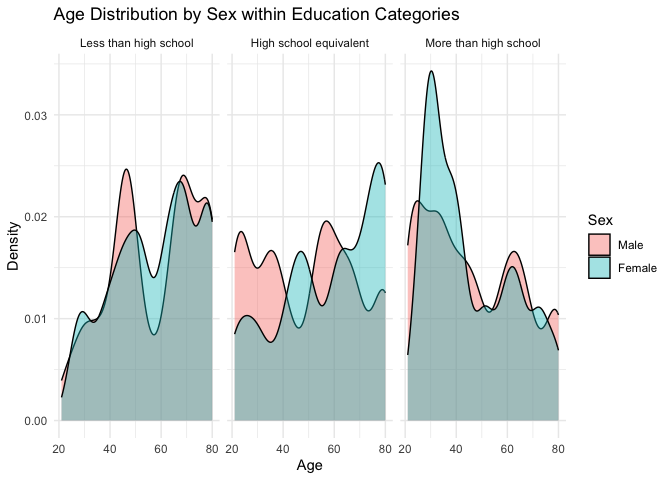
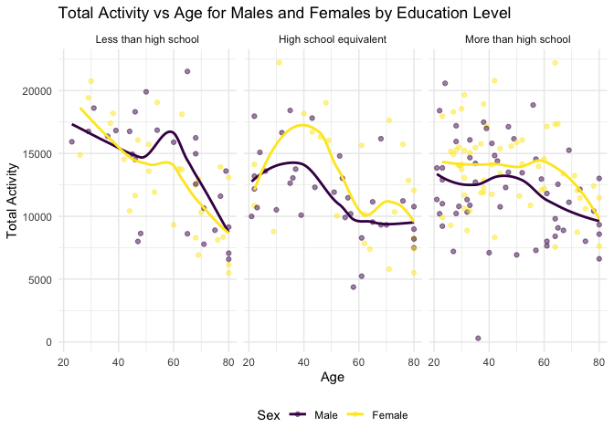
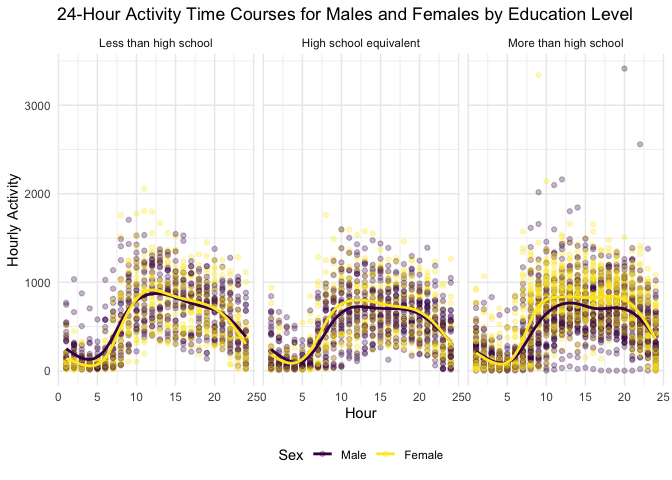
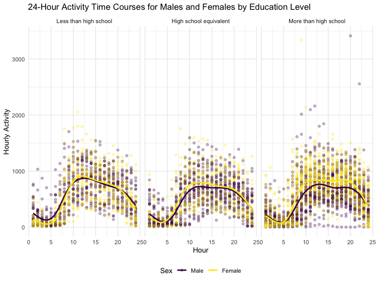
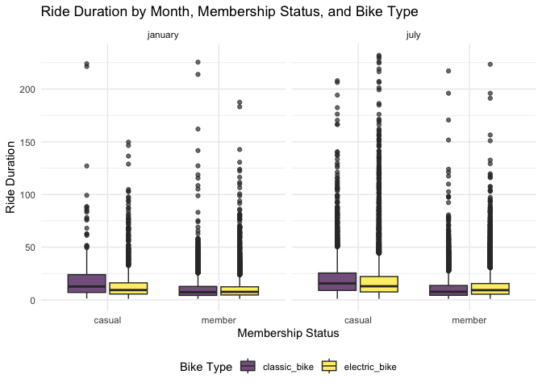

## Problem 2

    demo_df = read_csv("./data/nhanes_covar.csv", 
                       na = "NA", 
                       skip = 4) |> 
      janitor::clean_names() |> 
      filter(age >= 21) |> 
      drop_na() |> 
      mutate(sex = as.factor(sex),
        education = as.factor(education))

    ## Rows: 250 Columns: 5
    ## ── Column specification ────────────────────────────────────────────────────────
    ## Delimiter: ","
    ## dbl (5): SEQN, sex, age, BMI, education
    ## 
    ## ℹ Use `spec()` to retrieve the full column specification for this data.
    ## ℹ Specify the column types or set `show_col_types = FALSE` to quiet this message.

    mims_df = read_csv("./data/nhanes_accel.csv", 
                       na = "NA",
                       ) |> 
      mutate(across(min1:min1440, as.double)) |> 
      janitor::clean_names() |> 
      pivot_longer(
        cols = min1:min1440,
        names_to = "interval_min", 
        names_prefix = "min", 
        values_to = "mims"
      )

    ## Rows: 250 Columns: 1441
    ## ── Column specification ────────────────────────────────────────────────────────
    ## Delimiter: ","
    ## dbl (1441): SEQN, min1, min2, min3, min4, min5, min6, min7, min8, min9, min1...
    ## 
    ## ℹ Use `spec()` to retrieve the full column specification for this data.
    ## ℹ Specify the column types or set `show_col_types = FALSE` to quiet this message.

    acce_df = full_join(mims_df, demo_df, by = "seqn") |> 
      filter(age >= 21)

reader-friendly table of Number of Men and Women in Each Education
Category

    gender_table = demo_df |> 
      select(education, sex) |> 
      group_by(education) |> 
      count(education, sex) |> 
      
      pivot_wider(
        names_from = "sex",
        values_from = "n"
      ) |> 
      group_by(education) |> 
      mutate(
        education = factor(education, 
                           levels = c(1, 2, 3), 
                           labels = c("Less than high school", 
                             "High school equivalent", 
                             "More than high school"))
      ) |> 
      rename(Male = "1", Female = "2", Education = "education")

    knitr::kable(gender_table, caption = "Number of Men and Women in Each Education Category")

<table>
<caption>Number of Men and Women in Each Education Category</caption>
<thead>
<tr class="header">
<th style="text-align: left;">Education</th>
<th style="text-align: right;">Male</th>
<th style="text-align: right;">Female</th>
</tr>
</thead>
<tbody>
<tr class="odd">
<td style="text-align: left;">Less than high school</td>
<td style="text-align: right;">27</td>
<td style="text-align: right;">28</td>
</tr>
<tr class="even">
<td style="text-align: left;">High school equivalent</td>
<td style="text-align: right;">35</td>
<td style="text-align: right;">23</td>
</tr>
<tr class="odd">
<td style="text-align: left;">More than high school</td>
<td style="text-align: right;">56</td>
<td style="text-align: right;">59</td>
</tr>
</tbody>
</table>

Number of Men and Women in Each Education Category

The table is reader-friendly and shows the number of males and females
in each education category.

Less than high school: There are 27 males and 28 females in this
category.

High school equivalent: There are 35 males and 23 females in this
catgory.

More than high school: There are 56 males and 59 females in this
category.

Density plot of age distribution by sex in each education category

    demo_df |> 
      select(sex, age, education) |> 
      ggplot(aes(x = age, fill = sex)) +
      geom_density(alpha = 0.4, adjust = .5) + 
      facet_grid(~ education, labeller = 
                   as_labeller(c("1" = "Less than high school",
                                 "2" = "High school equivalent",
                                 "3" = "More than high school"))) +
      scale_fill_discrete(labels = c("Male", "Female")) + 
      labs(
        title = "Age Distribution by Sex within Education Categories",
        x = "Age",
        y = "Density",
        fill = "Sex"
      ) +
      theme_minimal() 

This density plot provides the age distributions for men and women in
each education category.

Less than high school: Both male and female in this category show peaks
around age 50 and age 70. There is a significant amount of overlaps
between male and female, indicating that males and females with a “Less
than high school” education have a similar age distribution.

High school equivalent: The density curve for male shows a peak around
age 25 and 55, while the curve for female shows a peak around age 50 and
a larger peak around age 80. There is less overlap, indicating there are
more age differences between males and females with a “High school
equivalent” education. It suggests that younger men are more likely to
have a “High school equivalent” education than women, while older women
are more likely to have this education than men.

More than high school: The density curves for both male and female have
peaks around age 30, indicating that younger individuals of both gender
are more likely to have a higher education. The peak of the female curve
is higher than male’s, showing that young women are more prominent in
this category. Both curves decrease sharply after age 65, indicating
fewer older individuals with the “more than high school” education.

aggregate across minutes to create a total activity variable for each
participant

    total_df = acce_df |> 
      group_by(seqn) |> 
      summarize(total_activity = sum(mims)) |> 
      left_join(demo_df, by = "seqn")

plot total activities against age, separate panels for education,
include trend line

    ggplot(total_df, aes(x = age, y = total_activity, color = sex)) +
      geom_point(alpha = 0.5) +  
      geom_smooth(se = FALSE) +  
      facet_grid(~ education, labeller = as_labeller(c(
        `1` = "Less than high school",
        `2` = "High school equivalent",
        `3` = "More than high school"
      ))) +
      labs(
        title = "Total Activity vs Age for Males and Females by Education Level",
        x = "Age",
        y = "Total Activity"
      ) +
      viridis::scale_color_viridis(name = "Sex", 
                                   labels = c("Male", "Female"), 
                                   discrete = TRUE) + 
      theme_minimal() + 
      theme(legend.position = "bottom")

    ## `geom_smooth()` using method = 'loess' and formula = 'y ~ x'

The scatter plot provides total activity vs age for males and females by
each education level. The plot compares men to women and includes a
trend line to illustrate differences in each category.

Less than high school: Women shows a higher total activity from age 21
to 40 but then surpassed by men after age 40. Men’s total activity has a
peak around age 60. Both men and women have a sharp decline in total
activity after age 60.

High school equivalent: Both men and women have a peak around age 40 but
then declined sharply from age 40 t0 60. Women have higher total
activity overall.

More than high school: Both men and women have a more flat trend line,
indicating a slower decline in total activity as age increases. Women
have higher total activity overall.

In general, The plot shows that higher education links with a more
stable activity level through different ages. While total activity
decreases with age, the rate of decreasing is lower for individuals with
higher education. Women with “less than high school” education are
generally less active than men, while women with “high school
equivalent” or “more than high school” education are more active than
men.

three-panel plot that shows the 24-hour activity time courses for each
education level and use color to indicate sex

    hour_df = acce_df |> 
      mutate(
        hour = pmin(as.numeric(str_extract(interval_min, "\\d+")) %/% 60 + 1, 24)
        ) |> 
      group_by(seqn, hour, sex, education) |> 
      summarize(hour_activity = sum(mims, na.rm = TRUE), .groups = "drop")

    ggplot(hour_df, aes(x = hour, y = hour_activity, color = sex)) +
      geom_point(alpha = 0.3) +  
      geom_smooth(se = FALSE) +  
      facet_grid(~ education, labeller = as_labeller(c(
        `1` = "Less than high school",
        `2` = "High school equivalent",
        `3` = "More than high school"
      ))) +
      labs(
        title = "24-Hour Activity Time Courses for Males and Females by Education Level",
        x = "Hour",
        y = "Hourly Activity"
      ) +
      viridis::scale_color_viridis(name = "Sex", 
                                   labels = c("Male", "Female"), 
                                   discrete = TRUE) + 
      theme_minimal() + 
      theme(legend.position = "bottom") 

    ## `geom_smooth()` using method = 'gam' and formula = 'y ~ s(x, bs = "cs")'

Less than high school: Women and men in this panel have very similar
trends in activity levels through the 24 hours. Both groups show a peak
of activity around 12PM and steadily decline after 8PM.

High school equivalent: Both women and men in this panel have a slightly
lower activity level compared to individuals with “less than high
school” or “more than high school” education. Men in this group have a
lower activity level than women.

More than high school: Overall, women in this panel have a noticeably
higher activity level than men, especially during midday and afternoon.

In general, Men and women in all education panels share a similar
activity patterns. The activity levels reach their peak around 12PM and
then sharply decreases from 8PM to midnight.

## Problem 3

Files contain 1% of all rides with a total duration less than 4 hours in
each of four months. Import, clean, and tidy these data, and describe
the resulting dataset.

    jan_20 = read_csv("./data/Jan 2020 Citi.csv") |> 
      mutate(month = "january",
             year = 2020)

    ## Rows: 12420 Columns: 7
    ## ── Column specification ────────────────────────────────────────────────────────
    ## Delimiter: ","
    ## chr (6): ride_id, rideable_type, weekdays, start_station_name, end_station_n...
    ## dbl (1): duration
    ## 
    ## ℹ Use `spec()` to retrieve the full column specification for this data.
    ## ℹ Specify the column types or set `show_col_types = FALSE` to quiet this message.

    jan_24 = read_csv("./data/Jan 2024 Citi.csv") |> 
      mutate(month = "january",
             year = 2024)

    ## Rows: 18861 Columns: 7
    ## ── Column specification ────────────────────────────────────────────────────────
    ## Delimiter: ","
    ## chr (6): ride_id, rideable_type, weekdays, start_station_name, end_station_n...
    ## dbl (1): duration
    ## 
    ## ℹ Use `spec()` to retrieve the full column specification for this data.
    ## ℹ Specify the column types or set `show_col_types = FALSE` to quiet this message.

    july_20 = read_csv("./data/July 2020 Citi.csv") |> 
      mutate(month = "july",
             year = 2020)

    ## Rows: 21048 Columns: 7
    ## ── Column specification ────────────────────────────────────────────────────────
    ## Delimiter: ","
    ## chr (6): ride_id, rideable_type, weekdays, start_station_name, end_station_n...
    ## dbl (1): duration
    ## 
    ## ℹ Use `spec()` to retrieve the full column specification for this data.
    ## ℹ Specify the column types or set `show_col_types = FALSE` to quiet this message.

    july_24 = read_csv("./data/July 2024 Citi.csv") |> 
      mutate(month = "july",
             year = 2024)

    ## Rows: 47156 Columns: 7
    ## ── Column specification ────────────────────────────────────────────────────────
    ## Delimiter: ","
    ## chr (6): ride_id, rideable_type, weekdays, start_station_name, end_station_n...
    ## dbl (1): duration
    ## 
    ## ℹ Use `spec()` to retrieve the full column specification for this data.
    ## ℹ Specify the column types or set `show_col_types = FALSE` to quiet this message.

    cb_df = bind_rows(jan_20, july_20, jan_24, july_24) |> 
      pivot_longer(
        start_station_name:end_station_name,
        names_to = "start_end",
        values_to = "station_name"
      ) |> 
      mutate(
        start_end = str_replace(start_end, "start_station_name", "start"),
        start_end = str_replace(start_end, "end_station_name", "end")
      ) |> 
      select(ride_id, rideable_type, weekdays, duration, member_casual, start_end, station_name, month, year)

Since the 3 datasets are already in a standard format with no missing
values, no additional data cleaning was required. Each dataset initially
contains 7 variables, including “ride\_id,” “rideable\_type,”
“weekdays,” “duration,” “start\_station\_name,” “end\_station\_name,”
and “member\_casual.” These variables are consistent within each
dataset.

To distinguish the month and year of the rides, I added 2 new columns
“month” and “year” to each dataset before combining. After merging the
datasets for January and July 2020 and 2024, I changed the combined
dataset into a tidy format. The “start\_station\_name” and
“end\_station\_name” columns are pivoted into 2 new columns “start\_end”
and “station\_name.” The “start\_end” indicates whether the station is a
start or end station for the ride, while the “station\_name” contains
the name of the corresponding station.

a reader-friendly table showing the total number of rides in each
combination of year and month separating casual riders and Citi Bike
members. Comment on these results.

    cb_df |> 
      group_by(year, month, member_casual) |> 
      summarise(total_rides = n_distinct(ride_id), .groups = "drop") |> 
      pivot_wider(
        names_from = member_casual,
        values_from = total_rides
      ) |> 
      knitr::kable(caption = "Total Number of Rides by Year, Month, and Rider Type")

<table>
<caption>Total Number of Rides by Year, Month, and Rider Type</caption>
<thead>
<tr class="header">
<th style="text-align: right;">year</th>
<th style="text-align: left;">month</th>
<th style="text-align: right;">casual</th>
<th style="text-align: right;">member</th>
</tr>
</thead>
<tbody>
<tr class="odd">
<td style="text-align: right;">2020</td>
<td style="text-align: left;">january</td>
<td style="text-align: right;">984</td>
<td style="text-align: right;">11436</td>
</tr>
<tr class="even">
<td style="text-align: right;">2020</td>
<td style="text-align: left;">july</td>
<td style="text-align: right;">5637</td>
<td style="text-align: right;">15411</td>
</tr>
<tr class="odd">
<td style="text-align: right;">2024</td>
<td style="text-align: left;">january</td>
<td style="text-align: right;">2108</td>
<td style="text-align: right;">16753</td>
</tr>
<tr class="even">
<td style="text-align: right;">2024</td>
<td style="text-align: left;">july</td>
<td style="text-align: right;">10894</td>
<td style="text-align: right;">36262</td>
</tr>
</tbody>
</table>

Total Number of Rides by Year, Month, and Rider Type

The table above shows the total number of rides in each combination of
year and month separating casual riders and Citi Bike members.

In January 2020, there were 984 rides by casual riders and 11436 rides
by members in the data.

In July 2020, there were 5637 rides by casual riders and 15411 rides by
members in the data.

In January 2024, there were 2108 rides by casual riders and 16753 rides
by members in the data.

In July 2024, there were 10894 rides by casual riders and 36262 rides by
members in the data.

a table showing the 5 most popular starting stations for July 2024;
include the number of rides originating from these stations

    cb_df |>
      filter(month == "july",
             year == 2024, 
             start_end == "start") |> 
      group_by(station_name) |> 
      summarize(number_rides = n_distinct(ride_id), .groups = "drop") |>
      arrange(desc(number_rides)) |> 
      slice(1:5) |> 
      knitr::kable(caption = "The 5 Most Popular Starting Stations for July 2024")

<table>
<caption>The 5 Most Popular Starting Stations for July 2024</caption>
<thead>
<tr class="header">
<th style="text-align: left;">station_name</th>
<th style="text-align: right;">number_rides</th>
</tr>
</thead>
<tbody>
<tr class="odd">
<td style="text-align: left;">Pier 61 at Chelsea Piers</td>
<td style="text-align: right;">163</td>
</tr>
<tr class="even">
<td style="text-align: left;">University Pl &amp; E 14 St</td>
<td style="text-align: right;">155</td>
</tr>
<tr class="odd">
<td style="text-align: left;">W 21 St &amp; 6 Ave</td>
<td style="text-align: right;">152</td>
</tr>
<tr class="even">
<td style="text-align: left;">West St &amp; Chambers St</td>
<td style="text-align: right;">150</td>
</tr>
<tr class="odd">
<td style="text-align: left;">W 31 St &amp; 7 Ave</td>
<td style="text-align: right;">146</td>
</tr>
</tbody>
</table>

The 5 Most Popular Starting Stations for July 2024

table of Median Ride Duration by Weekdays, Month, and Year

    cb_df |> 
      group_by(weekdays, month, year) |> 
      summarize(median_duration = median(duration), .groups = "drop") |> 
      ggplot(aes(x = weekdays, y = median_duration, fill = weekdays)) +
      geom_col(position = "dodge") +  
      facet_grid(year ~ month) +
      labs(
        title = "Median Ride Duration by Weekdays, Month, and Year",
        x = "Weekdays",
        y = "Median Ride Duration",
        fill = "Weekdays"
      )  +
      viridis::scale_fill_viridis(name = "Weekdays", 
                                   discrete = TRUE) + 
      theme_minimal() + 
      theme(axis.text.x = element_text(angle = 45, hjust = 1),
                  legend.position = "bottom") 

The plot shows that the median duration of ride tends to be higher in
year 2020 compared to 2024 for both July and January. July has higher
median ride duration than January for both years, potentially indicating
that people are more willing to ride at warmer days. The highest median
ride duration in the weekdays occurs on Saturday and Sunday most of the
time, except on January 2024, suggesting that most people tend to take
longer rides during the weekends.

demo\_df |&gt; select(sex, age, education) |&gt; ggplot(aes(x = age,
fill = sex)) + geom\_density(alpha = 0.4, adjust = .5) + facet\_grid(~
education, labeller = as\_labeller(c(“1” = “Less than high school”, “2”
= “High school equivalent”, “3” = “More than high school”))) +
scale\_fill\_discrete(labels = c(“Male”, “Female”)) + labs( title = “Age
Distribution by Sex within Education Categories”, x = “Age”, y =
“Density”, fill = “Sex” ) + theme\_minimal()

There were relatively few electric Citi Bikes in 2020, but many more are
available now. For data in 2024, make a figure that shows the impact of
month, membership status, and bike type on the distribution of ride
duration. Comment on your results.

    cb_df |> 
      filter(year == "2024") |> 
      pivot_wider(
        names_from = start_end,
        values_from = station_name
      ) |> 
      select(month, member_casual, rideable_type, duration) |> 
      ggplot(aes(x = member_casual, y = duration, fill = rideable_type)) +
      geom_boxplot(alpha = 0.7) + 
      facet_grid(~ month)  +
      labs(
        title = "Ride Duration by Month, Membership Status, and Bike Type",
        x = "Membership Status",
        y = "Ride Duration"
      ) +
      viridis::scale_fill_viridis(name = "Bike Type", 
                                   discrete = TRUE) + 
      theme_minimal() + 
      theme(legend.position = "bottom") 

The box plot shows that, regardless the month, type of bike, and member
status, most Citi Bike riders have a ride duration between 0 to 25
minutes. However, within every group, there are some outsiders with a
much longer duration, from 50 to over 200 minutes. Overall, casual
riders tend to have a longer ride duration in both January and July. For
classic bikes, the ride duration remain relatively consistent between
January and July. However, the ride duration of electric bikes in July
is noticeably higher than in January, possibly suggesting that electric
bikes may perform better in warmer temperature.
